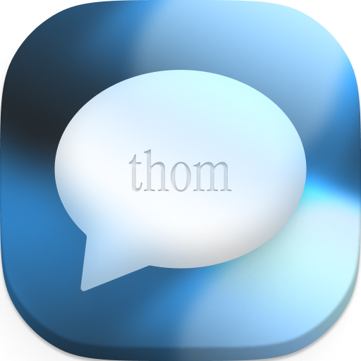

<div align="center">
  
  <h1>thom.chat</h1>
  <p><em>Open-source self-hostable T3 Chat.</em></p>

  <p>
    
    
    
    
  </p>

  <p>
    
    
    
    
  </p>
</div>

---

## ✨ About

**thom.chat** is an open-source alternative/clone to [T3 Chat](https://t3.chat/), built for [Theo's cloneathon](https://x.com/theo/status/1931515264497254402).

It is self-hostable, by self-hosting your own app and [https://www.convex.dev/](Convex) instance.

While thom.chat is a clone, the featureset is not identical to T3 Chat.

## 🎯 Key Features

### 🤖 **AI & Models**

- **Multiple AI Providers** - OpenAI, Anthropic, Google Gemini, Mistral, Cohere, OpenRouter
- **600+ AI Models** across all providers
- **Bring Your Own API Keys** - Users must provide their own API keys
- **No Usage Limits** - Use any model without restrictions when you have the API key

### 💬 **Chat Experience**

- **Real-time streaming** responses
- **Streaming on the server** for interruption-free chats, even when reloading
- **Chat branching** for exploring different conversation paths
- **Full-text search** across your entire chat history
- **Privacy mode** for secure screen sharing

### 📁 **Rich Content**

- **File uploads** with image support
- **Web search** integration for real-time information
- **Markdown rendering** with syntax highlighting
- **Chat sharing** with public links

### ⚡ **Productivity**

- **Cursor-like rules** for consistent AI behavior
- **Keyboard shortcuts** for power users
- **Enhance prompt** button for better prompts
- **Message regeneration** capabilities

## 🛠️ Tech Stack

<table>
<tr>
<td>

**Frontend**

- 🔥 SvelteKit
- 📝 TypeScript
- 🎨 Tailwind CSS
- 🍨 Melt UI Components

</td>
<td>

**Backend**

- 🔧 Convex Database
- 🔐 BetterAuth
- 🤖 Kepler AI SDK (Multi-provider support)
- 🦾 Blood, sweat, and tears

</td>
</tr>
</table>

## 🚀 Quick Start

### Prerequisites

- Node.js 18+
- pnpm (recommended)
- At least one AI provider API key (OpenAI, Anthropic, Gemini, etc.)

### Installation

1. **Clone the repository**

   ```bash
   git clone https://github.com/tglide/thom-chat.git
   cd thom-chat
   ```

2. **Install dependencies**

   ```bash
   pnpm install
   ```

3. **Environment setup**

   ```bash
   cp .env.example .env
   # Edit .env with your configuration
   ```

4. **Start development server**

   ```bash
   pnpm dev
   ```

5. **Open your browser**
   ```
   http://localhost:5173
   ```

## 🎮 Usage

### Getting Started

1. **Sign up** for a free account
2. **Add API Keys** - Go to Settings and add API keys for the providers you want to use:
   - **OpenAI** - GPT models, DALL-E, Whisper
   - **Anthropic** - Claude models
   - **Google Gemini** - Gemini models and vision
   - **Mistral** - Mistral models and embeddings
   - **Cohere** - Command models and embeddings  
   - **OpenRouter** - Access to 300+ models
3. **Start Chatting** - Select any model from your enabled providers

### Supported Providers

| Provider | Models | Streaming | Tools | Vision | Embeddings |
|----------|---------|-----------|-------|--------|------------|
| OpenAI | GPT-4, o3-mini, DALL-E, TTS | ✅ | ✅ | ✅ | ✅ |
| Anthropic | Claude 4, Claude 3.5 Sonnet | ✅ | ✅ | ✅ | ❌ |
| Google Gemini | Gemini 2.5 Pro, Imagen | ✅ | ✅ | ✅ | ✅ |
| Mistral | Mistral Large, Mistral Embed | ✅ | ✅ | ❌ | ✅ |
| Cohere | Command A, Command R+ | ✅ | ✅ | ❌ | ✅ |
| OpenRouter | 300+ models | ✅ | ✅ | ✅ | ❌ |

## 🤝 Contributing

We welcome contributions! Please see our [Contributing Guide](CONTRIBUTING.md) for details.

1. Fork the repository
2. Create your feature branch (`git checkout -b feature/amazing-feature`)
3. Commit your changes (`git commit -m 'Add amazing feature'`)
4. Push to the branch (`git push origin feature/amazing-feature`)
5. Open a Pull Request

## 📄 License

This project is licensed under the MIT License - see the [LICENSE](LICENSE) file for details.

## 🙏 Acknowledgments

- Inspired by [T3 Chat](https://t3.chat/)
- Built with [SvelteKit](https://kit.svelte.dev/)
- Powered by [Kepler AI SDK](https://deepwiki.com/keplersystems/kepler-ai-sdk)
- Database by [Convex](https://convex.dev/)

---

<div align="center">
  <p>Made with ❤️ by <a href="https://github.com/tglide">Thomas G. Lopes</a> and <a href="https://github.com/ieedan">Aidan Blesar</a></p>
  <p>
    <a href="https://thom.chat">🌐 Live Demo</a> •
    <a href="#-quick-start">📖 Documentation</a> •
    <a href="https://github.com/yourusername/thom-chat/issues">🐛 Report Bug</a> •
    <a href="https://github.com/yourusername/thom-chat/issues">💡 Request Feature</a>
  </p>
</div>
